# Introduction
## summarising objectives
- create semi-automated video processing analysis (reducing number of operators)
- processes normal match streams
- create framework for football data science research (academic or business)
- free and open source (will take additional work to avoid non compatible libraries with GPL3)

The project's aims are to collect track and event data from football footage. The ultimate goal is to be able to process any kind of footage but, for now, it will only process broadcast football matches.

## problems solved to achieve objectives
- general
    + low quality footage
    + weather and light visual conditions
    + detect refs by colour
    + detect people outside of the pitch
- detect humans
    + filter out referee(s)
    + detect players
    + identify players numbers
    + determine players position
    + playersbcrossing eachother
- detect ball
    + determine its position
    + track its position
    + 3D ball positioning estimation using physics model
    + ball tracking is suspended whenever an object obstructs the camera view
- detect pitch, by machine learning trained by creating image dataset
    + pitch geometry reconstruction
    + optical distortion
    + detect corner flags
    + detect goals
    + machine learning algorithm to
    + algorithm to determine inner section
    + different camera/editing/perspective
- map players and ball to pitch
    + predict possible position of off sight players
    + positioning flipping
- recognise players
    + player's numbers extraction
- action detection
- collect data
    + collect event data
    + collect tracking data
    + synchronise event and tracking data
    + synchronise footage and data timestamps

### pseudocode

pseudocode for image recognition

development of 3-d modelling
pseudocode for 3-d modelling data set generation
machine learning model and algorithm
geometry reconstruction algorithm

### images

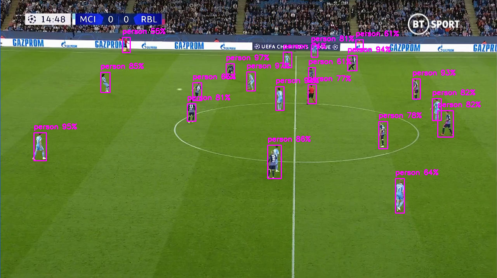
description

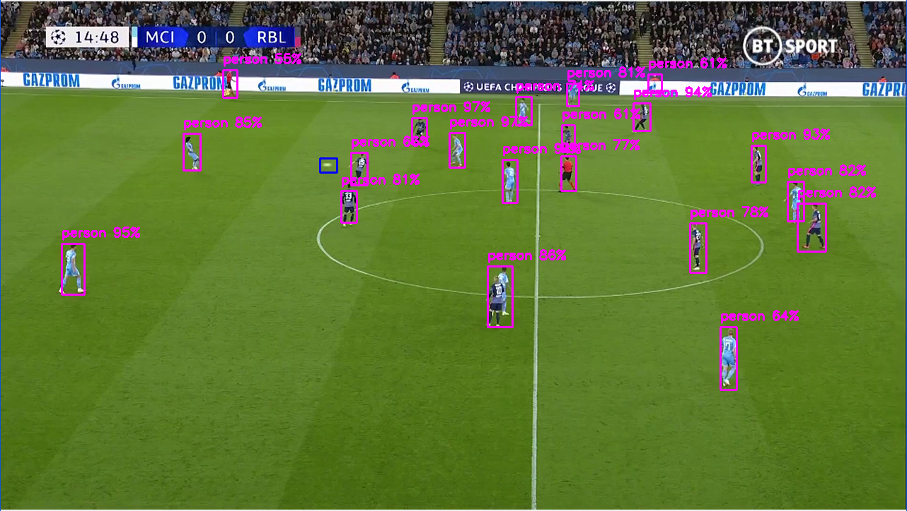
description

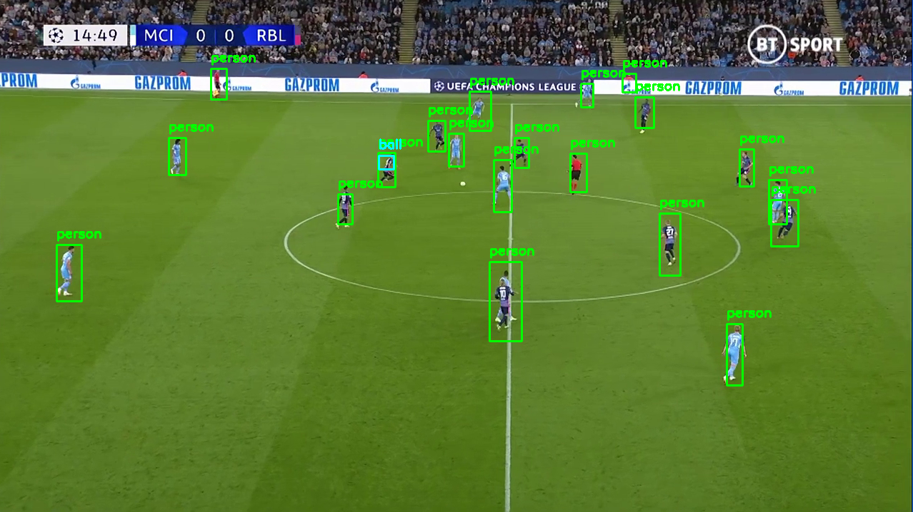
description

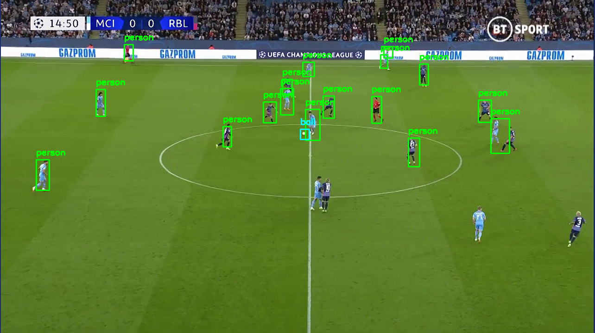
description

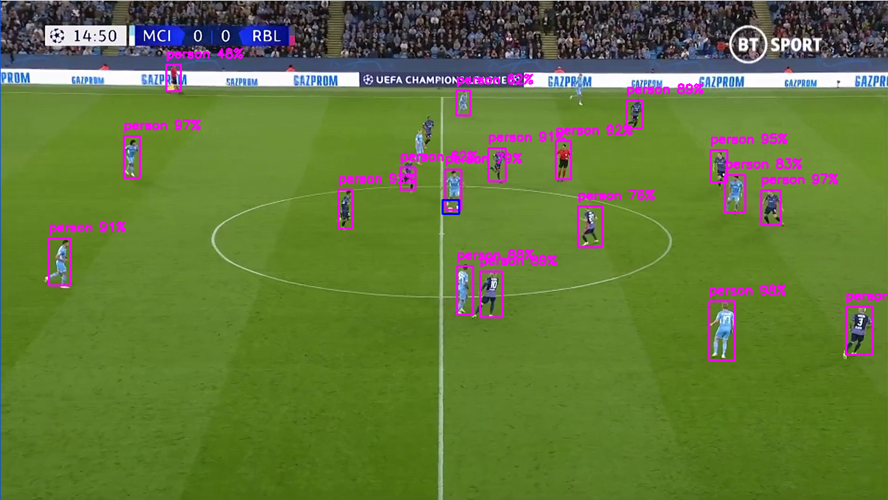
description

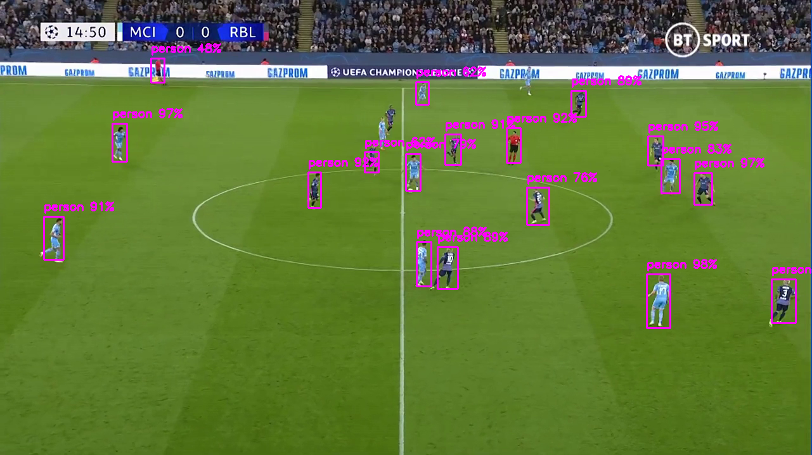
description

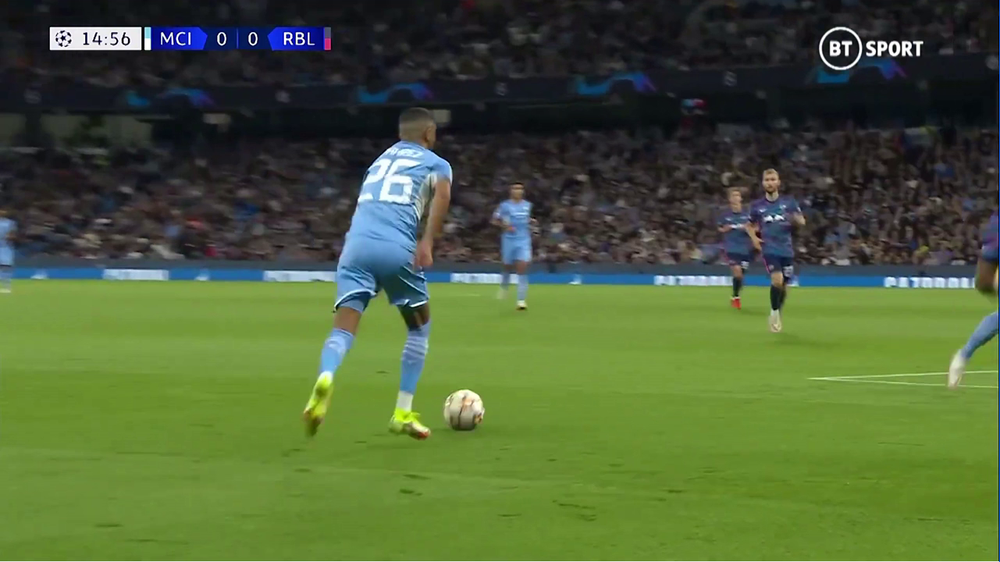
description

description

description

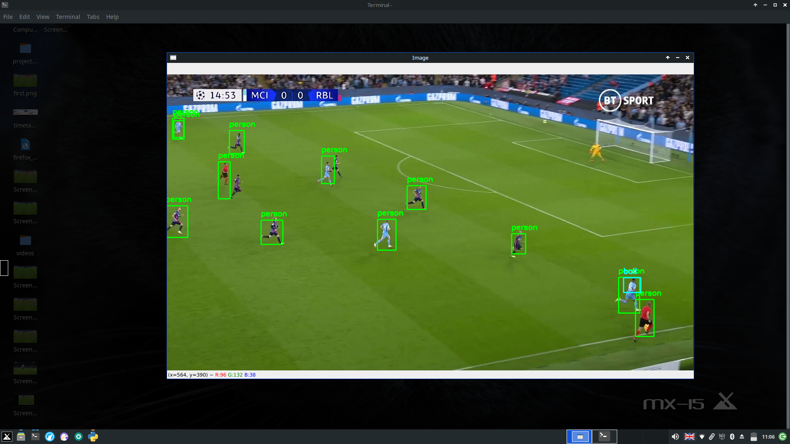
description

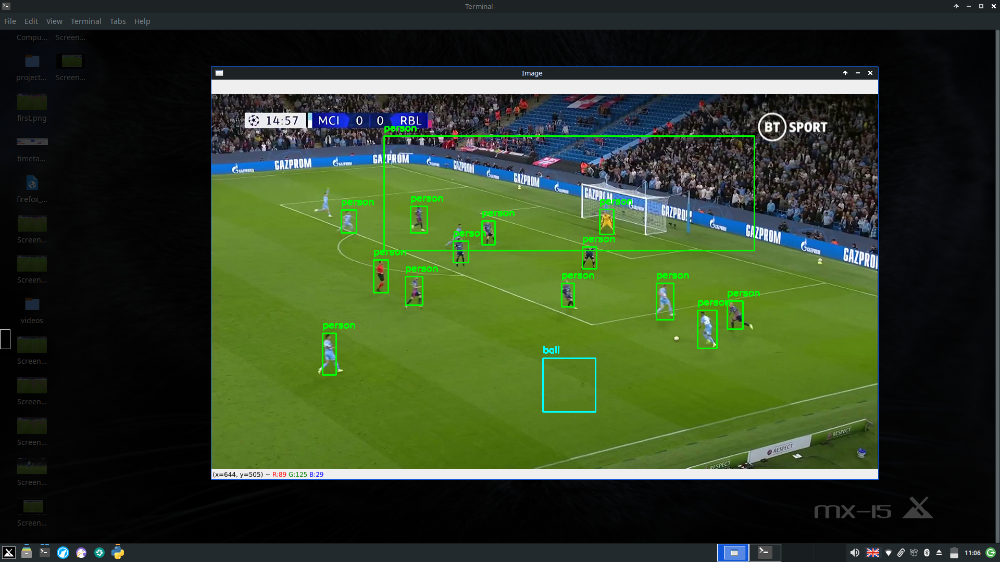
description

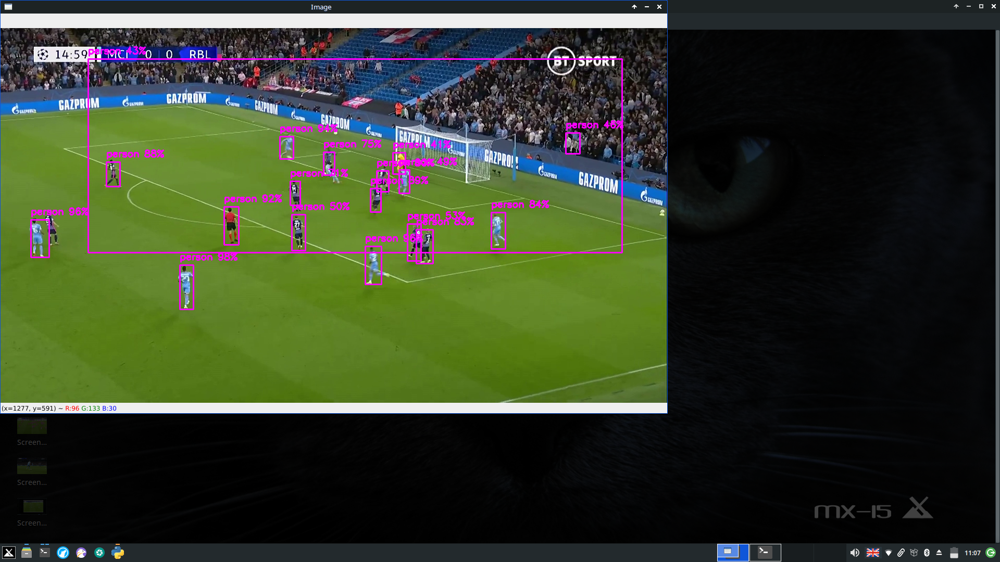
description

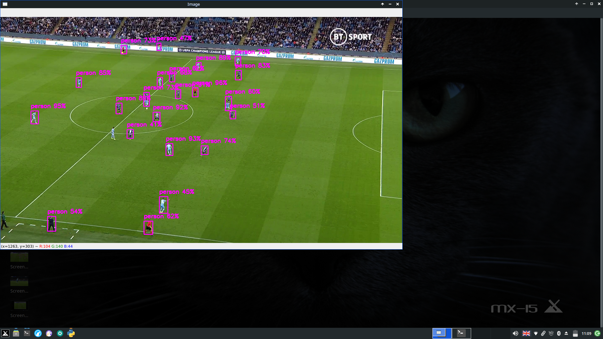
description

description

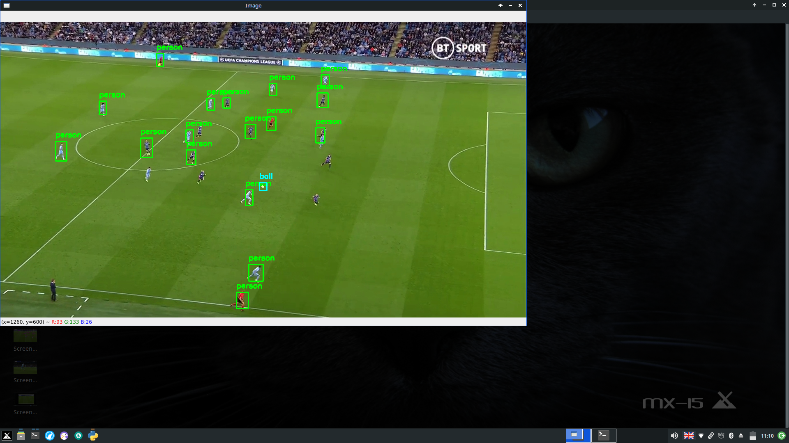
description

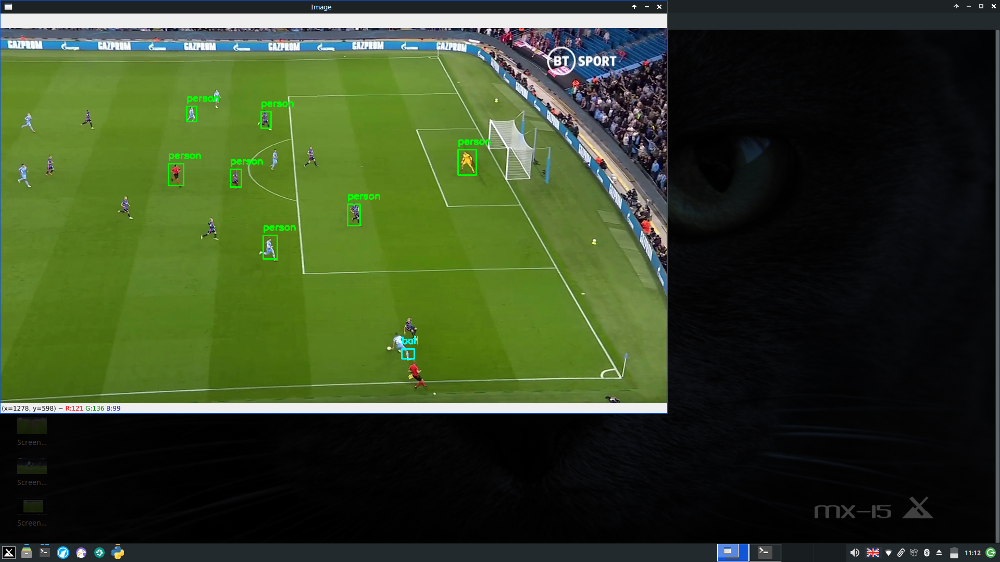
description

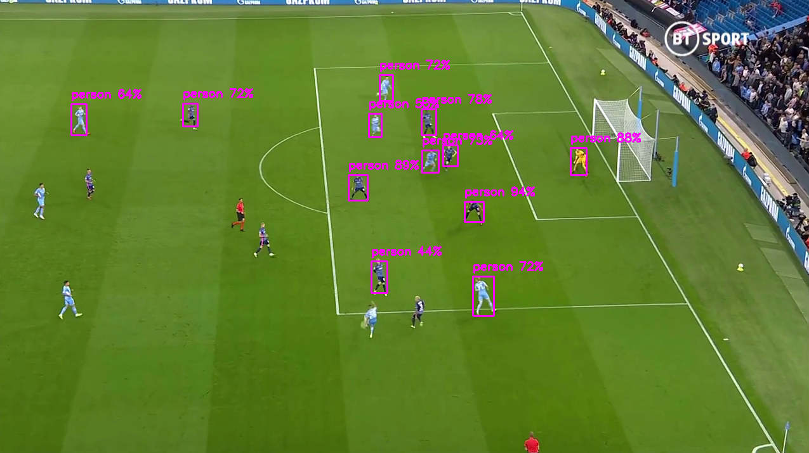
description

description

## methods
- image processing operations
    + openCV
- image recognition
- object tracking
- sythetic image dataset
- image homographical transformation
- deep/machine learning
- video/play segmentation
- Image Processing
- Object detection (YOLO v4)
- Object interaction tracking
- Object motion tracking
- Multi-algorithm implementation (Detection -> tracking -> identification)
- Machine learning (Extrapolation; training against current data)
- Human pose estimation
- grid positioning
- 3D human interaction

## results

(sshot> image recognition, ball and humans)

(sshot> pitch 3d modelling)

(sshot> camera automation, in dataset)

## achievements and limits
### achievements

### limits
spatio-temporal data stream correction
human detection may contain more than 1 human
    consistent ball detection

- Human agent must verify and validate data collection
- Human agent must input match meta data
- Human agent must supervise/calibrate video processing
- Tracking broadcast is affected by zoom/replays and camera changes

## dissertation organisation sketch

# Background
        SKIP!!!!!!!!!!!!!!!!!!!!!

# Work carried out

- video processing
    + machine learning humans and ball recognition
    + object traking
- 3d modelling and dataset generation
    + pitch construction in blender
    + camera positioning
    + data generation scripting
    + homographical transformation

# Testing
## Testing assessment

testing with random camera, get accuracy

## Performance assessment

## any other experimental work

# Conclusions
## main achievements
        (relating them to initial objectives)
        (as well as similar worh from others)

## the main limitations of work
- detect ball consistently
- the output will always be an approximation
- video segment detection (also replays)
- calculate ball trajectory
- cannot detect players outside camera frame
- is not real-time, at this moment
- recognise video segments

## possible extensions and future work
- create data format (possibly logical ontology to leverage a logical reasoner) to create a richer dataset

- use Google Research Football Environment
    + predict off-screen player positioning
    + predict player actions
- action recognition
- modularise all modules and algorithms to allow other sports
- allow python running
