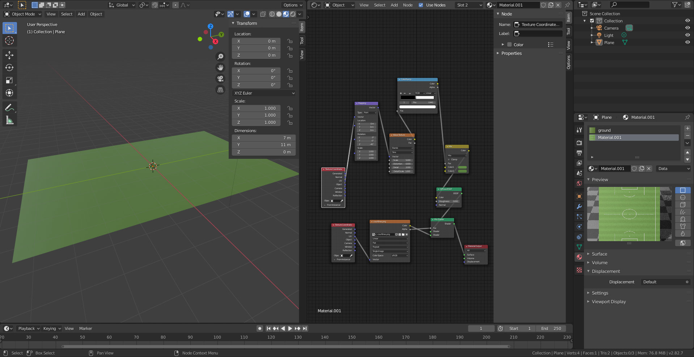
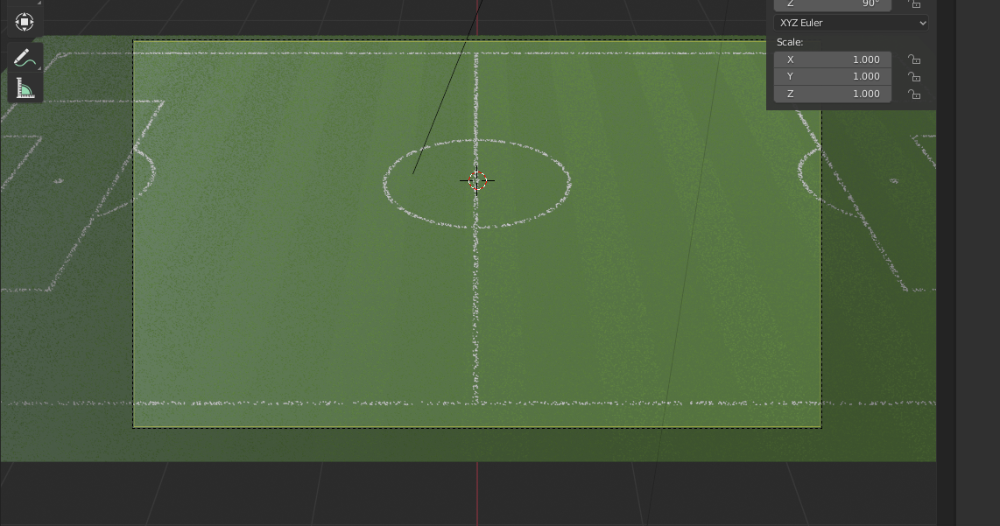
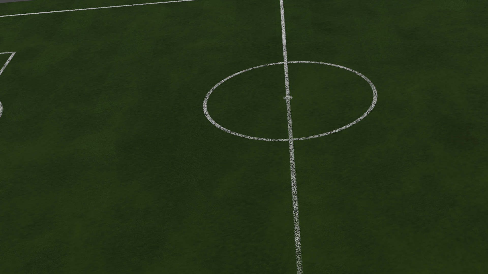
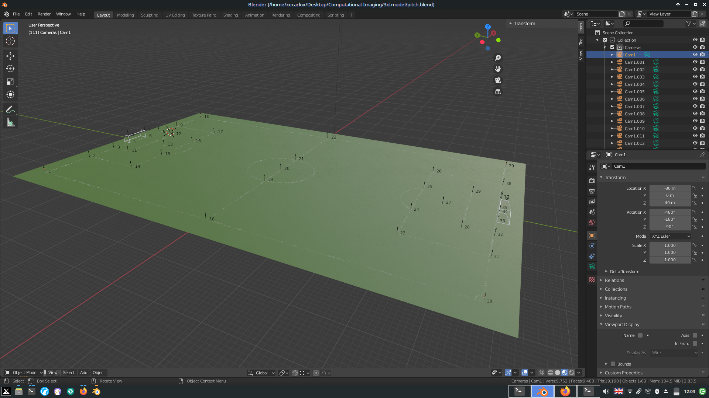
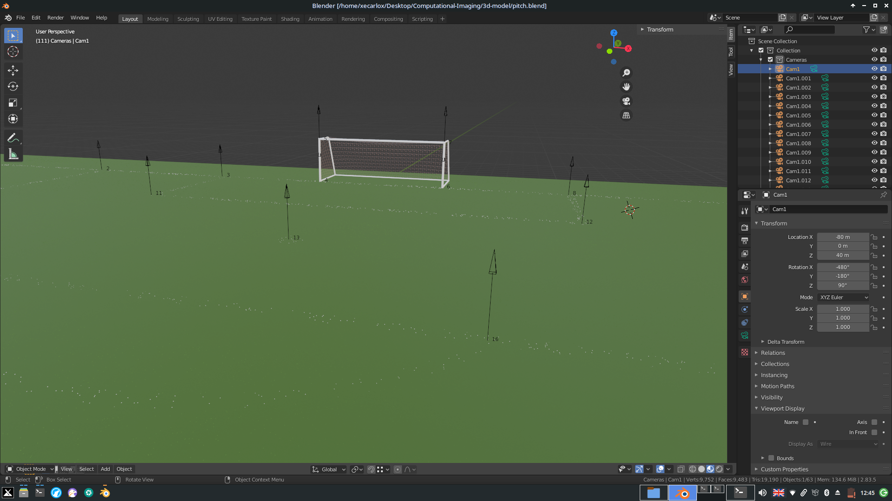
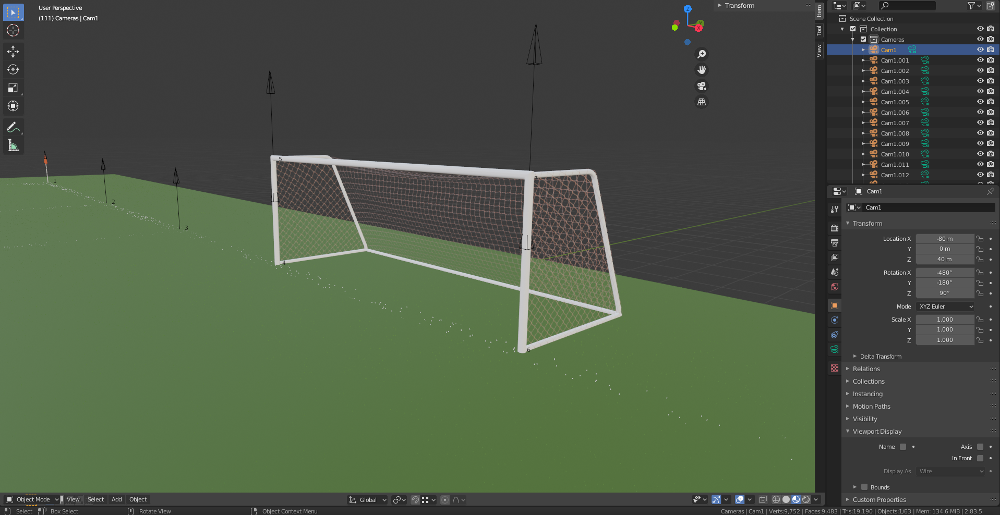
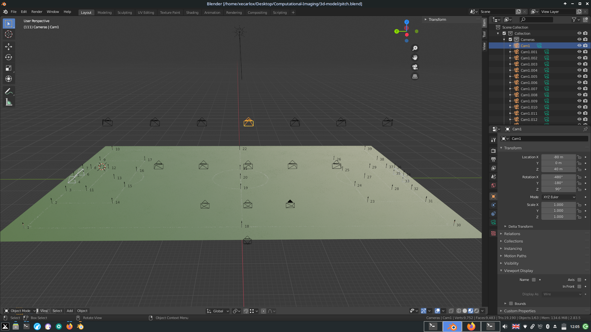

# Introduction
## summarising objectives
- very ambitious
- create solid foundation
- long future project
- long goal of modularising this football framework into a collective sports library composed of smaller reusable/generic units because collective sports have different dynamics
- create semi-automated video processing analysis (reducing number of operators)
- processes normal match streams
- create framework for football data science research (academic or business)
- free and open source (will take additional work to avoid non compatible libraries with GPL3, it iwll have loads of moving parts) (took a lot of time but had to use AI libraries that force me to use Lesser GPL3 license instead)

The project's aims are to collect track and event data from football footage. The ultimate goal is to be able to process any kind of footage but, for now, it will only process broadcast football matches.

## problems solved to achieve objectives
- data processing
    + encode and decode positional data
    + encode and decode image data
    + various changes
- 3d modelling
    + creating realistic 3d environments with main features
    + create reference map
    + automate cameras
    + geometric calculations to get outputs
- machine learning modeling
    + test and measure different architectures
    + preprocess images
- detect humans
    + detect players
    + track players
    - recognise players
        - identify players numbers
        - identify players visual characteristics
    - filter out referee(s)
    - detects large human (noise, needs to be removed)
    - determine players position
    - if camera moves too suddendly, few players will be tracked until next object detection
- detect ball
    + detect ball
    + track ball

- pitch geometry reconstruction
    - optical distortion
    - algorithm to determine inner section
    - image homographical transformation
    - grid positioning
    - map players and ball to pitch
- video processing
    - video/play segmentation

- general
    - low quality footage
    - weather and light visual conditions
    - detect refs by colour
    - ignoring people outside of the pitch
    - short video (replay/sudden angles) segments interrupt data collection

## methods
- image/video processing operations (openCV)
    + video stream processing
    + manual labelling of image
    + image processing (colour conversion)
    + image masking to what is green
    + image cannying
    + manual segmentation of video
    + correction of ball labelling
- sythetic image dataset (Blender)
    + create 2d pitch png image
    + create pitch texture
    + create goals objects
    + create cameras and automate them
    + create script to render images and automate camera movement
    + pitch construction in blender
    + camera positioning
    + data generation scripting
    + homographical transformation
    + create script to extract data from 3d world
    + encode data onto file
    + create decoding data
- deep/machine learning (tensorflow)
    + create convolution network
    + create multiple machine learning pipelines
    + creating recursively conditional machine learning model
    + first detect camera location, then frame positions, then corner positions, and finally rest of point on the screen
- Object detection (YOLO v4)
    + uses a preconfigured convolution network, already tested (version 4)
    + uses a pretrained model
    + detects many types of objects (in coco.names)
    + algorithm filters all objects detected but human and balls
    + humans are detected above a certain threshold
    + if successful, the ball is returned by taking the detection with the highest confidence
    + Non-maximum suppression is used, based on the human detection threshold and the Non-maximum suppression threshold, to remove the overly redundant overlapping detections
- Object tracking (OpenCV tracking)
    + takes detection bounding boxes and creates trackers
    + using CSRT tracker to follow humans and ball
    + tracker updates every frame
    + restarts tracking when yolo detection runs again

To add to methods section
+ pseudocode for image recognition
+ development of 3-d modelling
+ pseudocode for 3-d modelling data set generation
+ machine learning model and algorithm
+ geometry reconstruction algorithm

## results

(sshot> image recognition, ball and humans)

players are detected but ball is not (purple means that object recognition just ran).
multiple players are detected in the same bounding box.
refs are detected as well.
one steward is also detected.
streaming is stopped because ball is not found.

players bounding boxes in green means that it is tracking.
manually labelling ball to continue stream.

ball tracking  is lost and tracks the numbers on the players back.

player tracking continues.
new players appear on the screen but they are not detected until 30frame period runs object detection again.

ball tracking is lost again because of the pitch lines and player boots.
some players previously detected are lost because of the backgroup from ads or pitch (not enough constract).

ball needs to be labelled again to be tracked again.

the object detection is ran.
all the human trackers are removed but the ball tracker.
the ball tracker is not reset if the ball is still being tracked.

the players tracker had to be reset again from the <prev img> because the detected players moved out of the screen in the meantime.
ball tracker continues to run, regardless.

the ball tracker is wrong again, by tracking the player's back number.

this is a video segment imposed by the director.
data cannot be collected.
this is a short moment.

ball is tracked from the <prev img> since the label needs to be labelled for the stream to continue (needs to cut the scene).
there is a bug, a human is recognised due to noise.

players are detected again.
the bug stil persists.
a fan is recognised in the crowd.
the ball is again not recognised.

most players are visible from this new perspective.
The ball is not recognised.

most of the players are recognised from this perspective.
The ball is visible and being tracked.

in this frame few players were recognised because the camera view moved very suddendly (from the previous frame <prev img>) in betwee the object detection cycle.
The ball tracker was lost and it is tracking the payer's leg instead.

In this frame most players are detected including all players inside the box which is the region of interest when a team is attacking.
The ball tracker has lost the ball because the camera view is being blocked by the crossing player's leg.
(sshot> pitch 3d modelling and camera automation)

## achievements and limits
### achievements

creating video collection algorithm for sports

creating realistic 3d pitch model

creating complete 3d model data generation framework

creating recursively conditional machine learning model

creating geometric framework to map objects from screen on pitch, and vice versa

### limits
human detection may contain more than 1 human
    non-consistent ball detection

- Human agent must verify and validate data collection
- Human agent must manully segment video streams
- Human agent must input match meta data
- Human agent must supervise/calibrate video processing
- Tracking broadcast is affected by zoom/replays and camera changes

## dissertation organisation sketch

# Background
        SKIP!!!!!!!!!!!!!!!!!!!!!

# Work carried out

## video processing
    - machine learning humans and ball recognition
    - object traking

## 3d modelling and dataset generation

s[text description](./images/coordinates.png)
created 3d reference system that maps the points recognisable by the camera.
This will be used for the artificial intelligence model to train the model and to process the video stream to perform the homographic transformation.

The 3d model was developed on blender. It is a green 3d texture (to emulate the grass) with a pitch png transparent graphic to produce the white lines.

The result is a realistic pitch replica that can be rendered by a blender camera to produce the synthetic dataset

this is the rendered image from a blender camera, this image is then the processed to be then used as the input for the artifical intelligence model.

The pitch was then improved by adding 3d markers corresponding to the map reference system.
These markers can be accessed by the blender cameras to retrieve their position on the camera view and their relative position to the cartesian origin.

This is the view of the box which shows the position of the markers from a closer view

This is the view from the goal which is an important object that is important for image recognition. it has the only markers with a positive z-index to emulate the top corners of the goal.
It also includes the corner flag (on the left) because all pitches have them by regulation.

The final step is to create 15 cameras which will rotate within a range and will render images for the dataset from these different position to emulate the real camera which will be put in different positions.

# Testing
## Testing assessment

testing with random camera, get accuracy

## Performance assessment

## any other experimental work

# Conclusions
## main achievements
        (relating them to initial objectives)
        (as well as similar worh from others)

## the main limitations of work
- the output will always be an approximation (real world)
- detect ball consistently
- calculate ball trajectory
- ball tracking is suspended whenever an object obstructs the camera view
- players crossing eachother
- cannot detect players outside camera frame. could create AI model for calculating probable player in position
- cannot recognise players on camera frame. could create AI model for calculating their identity based on position/appearence
- is not real-time, at this moment

- Currently not able to track 3d trajectory of objects
- green masking may not work for non-green pitches and green kits

## possible extensions and future work

- use Google Research Football Environment
    - train models and track their movements and actions
    - predict off-screen player positioning
    - actions recognition

- modularise all modules and algorithms to allow other sports

- dataset generation
    - add random noise to improve dataset and model

- video segment detection (also replays)
    - recognise video segments
    - set-pieces recognition
    - clustering/unsopervised problem!!!!!

- methods will not apply
    - spatio temporal data stream correction
    - Human pose estimation
    - 3D human interaction
    - Machine learning (Extrapolation; training against current data)
    - spatio-temporal training (pitch detection, player position detection, actions ....)
    - Object interaction tracking
    - Multi-algorithm implementation (Detection -> tracking -> identification)

- data collection
    - create data format (possibly logical ontology to leverage a logical reasoner) to create a richer dataset
    - collect event data
    - collect tracking data
    - synchronise event and tracking data
    - synchronise footage and data timestamps

        -----> space and spatial multiple image semantic matching

## extra
+ when downloading copyrighted recordings or process data, reference source and its copyright
+ set up public dataset for public use by academics

